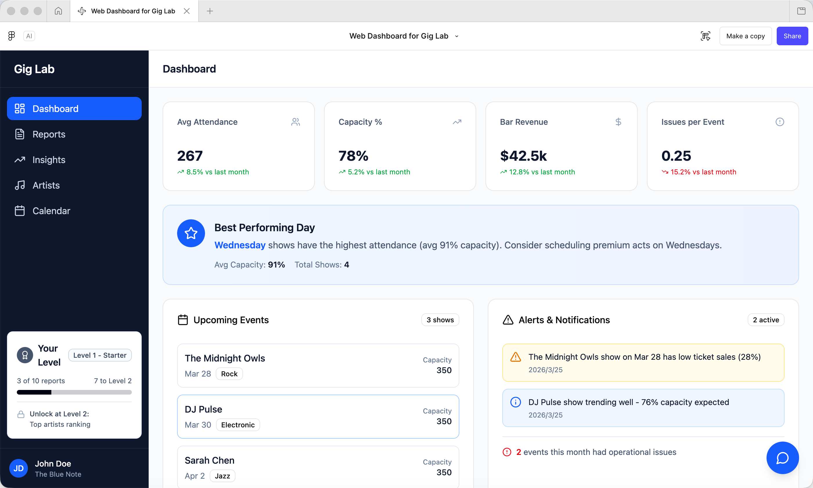
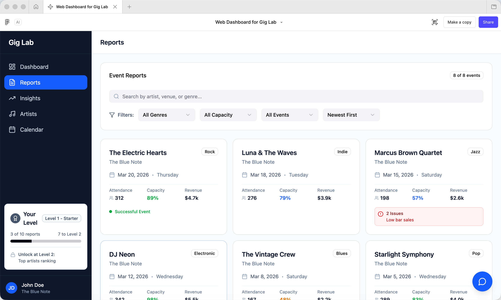
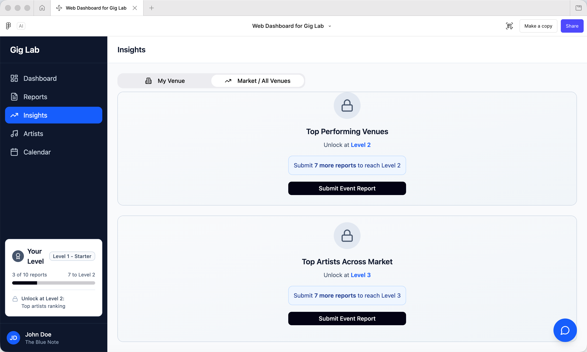
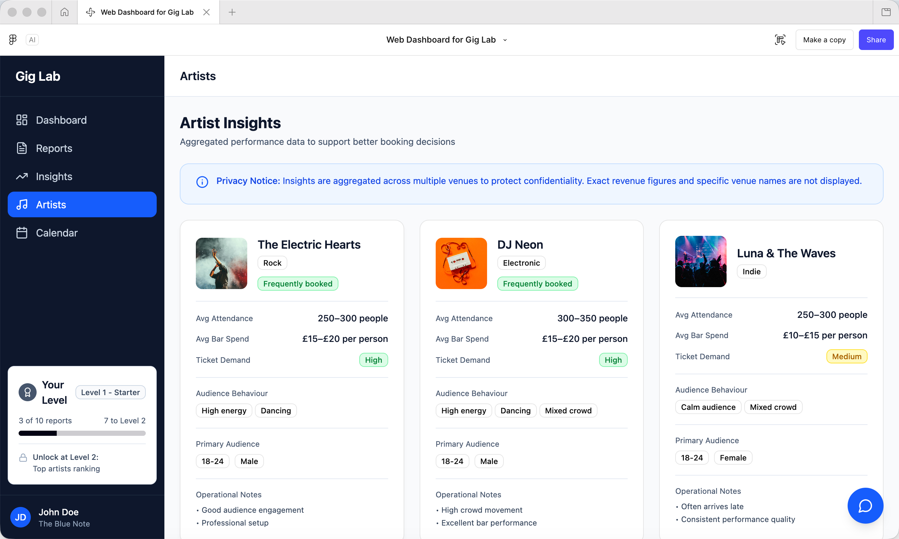
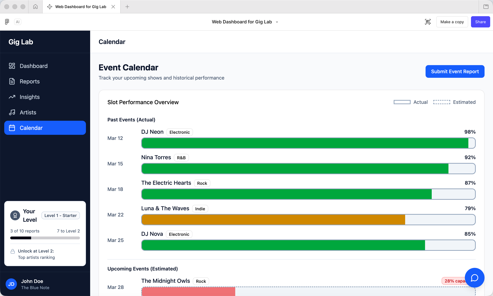

# Gig Lab Analytics Dashboard (Bootcamp Project)

This project was developed during the **Spring 2026 Data Innovation Bootcamp (Newcastle University)**.

It focuses on analysing live music venue data and designing a **data-driven dashboard + interactive UI prototype** to support venue managers and promoters in making operational and commercial decisions.

---

## 🚀 Project Overview

Gig Lab is a data-driven analytics platform designed for stakeholders in the live music ecosystem.

The project explores:

- Venue performance (attendance, revenue, capacity utilisation)
- Event timing patterns (weekday vs weekend, late-night trends)
- Audience behaviour and engagement
- Operational insights for improving event success

---

## 📊 Key Features

- Exploratory Data Analysis (EDA) on real-world event data
- Visualisation of sales, attendance, and time patterns
- Insight generation for business decision-making
- Dashboard-oriented thinking (not just charts, but decisions)

---

## 🎨 UI Design (Figma Prototype)

👉 View interactive prototype:  
🔗 https://www.figma.com/make/MDV4kabQzdOAFCW4RPdR1r/Web-Dashboard-for-Gig-Lab?fullscreen=1&t=x0lLG5WwGn4mSnkw-1&preview-route=%2Fprofile

The UI design focuses on:

- Clean dashboard layout for quick decision-making
- Modular components (Reports, Insights, Artists, Calendar)
- Data-to-decision flow (not just display)
- User-friendly filtering and interaction

---

## 🖥️ UI Screenshots

### Dashboard

### Reports

### Insights

### Artists

### Calendar

---

## 🧠 Key Insight

This project bridges **data analysis + product thinking + UI design**, demonstrating how data can be transformed into actionable insights through an intuitive interface.

---

## 📌 Note

The dataset used in this project was provided as part of the bootcamp and has been anonymised.
